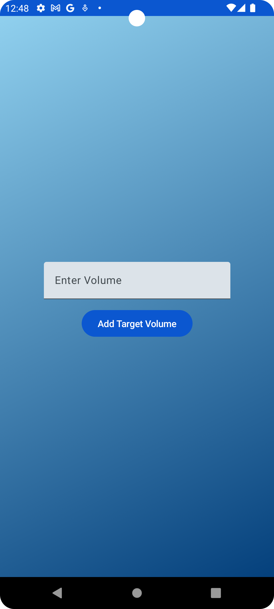
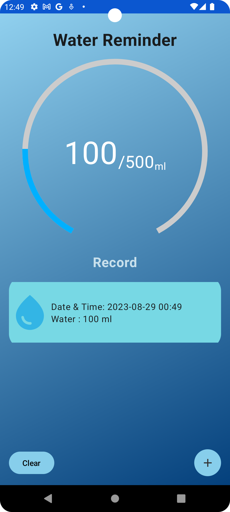
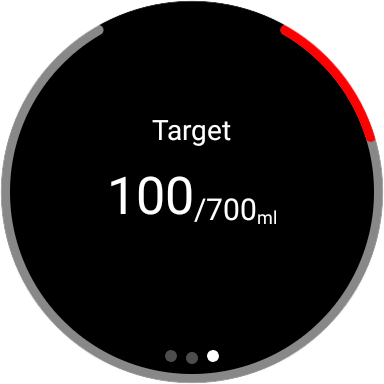
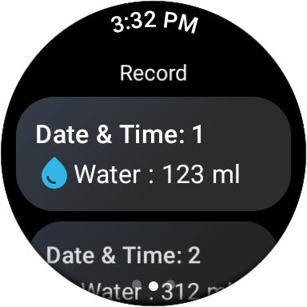

# WaterReminder

Welcome to the WaterReminder project! This repository is a collection of sample code designed to demonstrate the power of Jetpack Compose, a modern Android UI toolkit. Additionally, it showcases the seamless data transfer capabilities between WearOS and Android devices, exemplifying effective communication between these platforms.

## Project Objective
The main goal of this project is to provide developers with practical examples of utilizing various Jetpack Compose features and components. Furthermore, it offers insights into implementing data transfer functionality between WearOS and Android devices, enabling a fluid exchange of information.

## Screenshots

### Android Devices:

  <!-- Adjust the width attribute as needed to control the size -->
  
  

### WearOs:

  <!-- Adjust the width attribute as needed to control the size -->
  
  

## Getting Started
To explore the examples provided in this project, follow these steps:

1. Clone the repository or download the source code as a ZIP file.
2. Open the project in Android Studio.
3. Run the examples on an emulator or physical device.

## Examples

The project includes examples of using Jetpack Compose and Coroutines together, including:

- [Text](https://developer.android.com/jetpack/compose/text)
- [Buttons](https://www.jetpackcompose.net/buttons-in-jetpack-compose)
- [Lists](https://developer.android.com/jetpack/compose/lists)
- [Navigation](https://developer.android.com/jetpack/compose/navigation)

## TODO
Here are the upcoming enhancements planned for the project:

#### Code Style Refactor:
Enhance code structure and formatting to ensure maintainability.
#### Data Sync: Implement:
seamless data synchronization between Android Devices and Wearable Devices.
